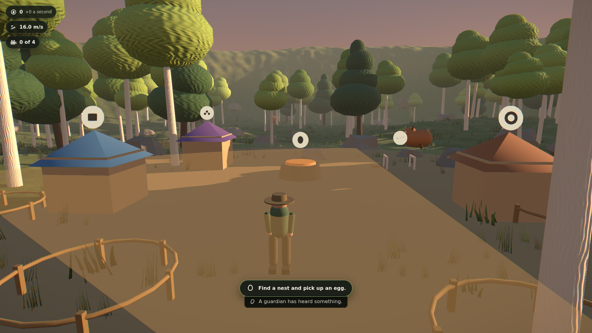
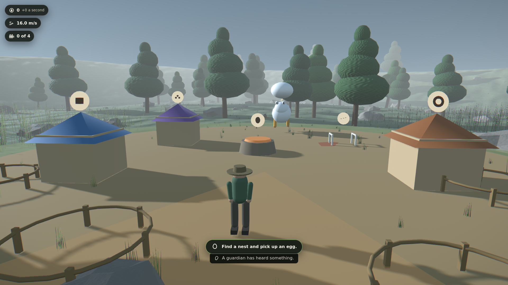
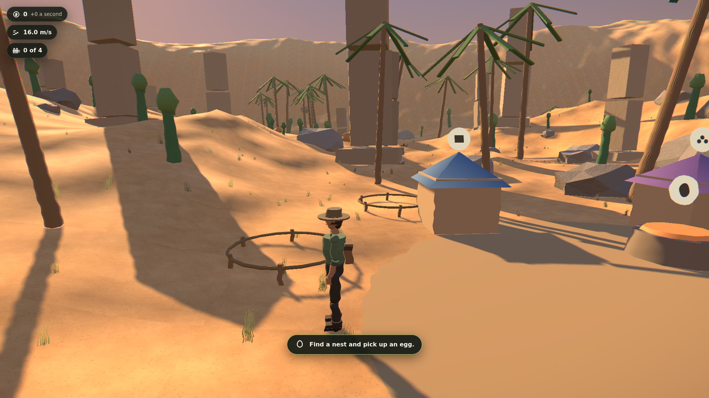
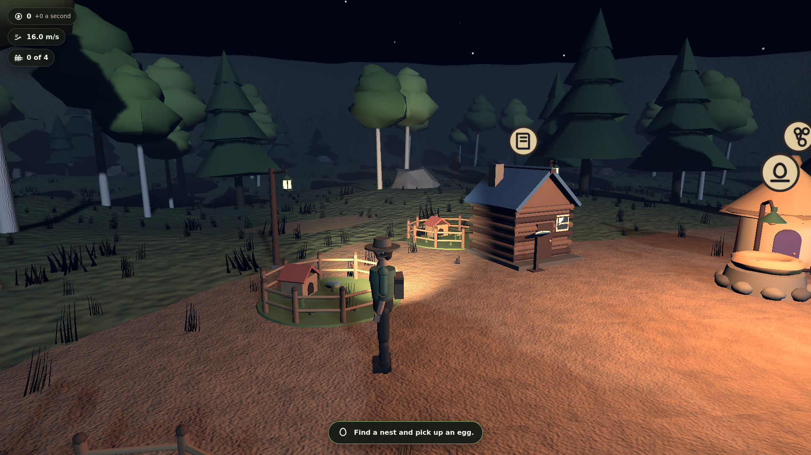

# Egg Heist: Wildlands

A 3D stealth-and-collect game for the browser, aimed at 8–12 year olds.

You are a junior ranger at the Wildlands Sanctuary. Rare eggs have been
scattered across the reserve and rival collector clubs are racing you to
them. Recover eggs, incubate them safely, release the hatchlings into your
habitats, and let visitor donations fund better gear so you can reach the
wilder zones.

Nobody is harmed. Nothing is destroyed. Guardians _shoo_ you away — they
never hurt you, and every egg ends up safe.

---

## Screenshots

|                                                                 |                                                               |
| --------------------------------------------------------------- | ------------------------------------------------------------- |
|                      |                 |
| **Whisper Glade** — dawn woodland, the tutorial by design       | **Mirrormere** — misty lake, reeds break the Swan's sightline |
|                       |                   |
| **Amber Dunes** — open sand, almost no cover, plan around sound | **Low preset** — the same place on integrated graphics        |

`docs/shots/` also has Whisper Glade at all four quality presets, which is
the M2 gate.

---

## Playing

| Action              | Keyboard | Gamepad      | Touch                     |
| ------------------- | -------- | ------------ | ------------------------- |
| Move                | `WASD`   | Left stick   | Left half of the screen   |
| Look                | Mouse    | Right stick  | Right half of the screen  |
| Sprint              | `Shift`  | `L3` or `LT` | Push the stick to the rim |
| Jump / vault        | `Space`  | `A`          | On-screen button          |
| Crouch / slide      | `Ctrl`   | `B`          | On-screen button          |
| Pick up / use       | `E`      | `X`          | Tap the prompt            |
| Throw a tool        | `Q`      | `LB`         | On-screen button          |
| Photo mode          | `P`      | —            | Pause menu                |
| Menu                | `Esc`    | `Start`      | Pause button              |
| Performance overlay | `F3`     | —            | —                         |

Every binding can be moved, including onto one side of the keyboard for
one-handed play. Sprint and crouch each support hold-or-press-once.

Keyboard, gamepad and touch are all live at once — there is no input mode to
choose, and the on-screen prompts follow whichever device you last touched.

---

## The loop

1. **Scout** — pick a nest, read the Guardian's patrol, plan a route.
2. **Snatch** — grab the egg. A rarer egg is a heavier egg and slows you down.
3. **Escape** — sprint, vault, slide, throw a distraction, get home.
4. **Incubate** — place it in the incubator and watch it warm up.
5. **Release** — put the hatchling in a habitat where visitors leave donations.
6. **Upgrade** — spend donations on Pace, habitat slots and gear.
7. **Unlock** — cross a Pace threshold and the next biome opens.

About ninety seconds end to end, and the first egg is in the incubator inside
sixty. Those are not guesses: `tests/unit/pacing.test.ts` simulates 200
sessions and asserts both.

### The three laws

1. **Failure costs time, never progress.** Caught means a comic tumble, a
   dropped egg and three seconds. Never money, hatchlings, upgrades, or a
   session.
2. **One stat is the spine.** _Pace_ gates content, enables skill and absorbs
   upgrades. There is no parallel progression track.
3. **Variance lives on the payout, not the challenge.** Mutations and sizes
   make rewards exciting. The run itself is always fair and readable.

---

## For parents

Short version: no accounts, no data leaves the device, no adverts, nothing to
buy, no chat, no dark patterns, nothing gets hurt, and nothing flashes.

Every one of those is enforced by an automated test rather than by intention.
**[PARENTS.md](PARENTS.md)** says which test enforces which promise, and the
same information is inside the game under "For grown-ups".

---

## Running it

```bash
npm install
npm run dev        # development server
npm run build      # typecheck, then production build to dist/
npm run preview    # serve the production build
```

| Command        | What it checks                                                                  |
| -------------- | ------------------------------------------------------------------------------- |
| `npm test`     | Vitest: movement feel, guardian FSM, economy, pacing, save schema, cue registry |
| `npm run lint` | ESLint + Prettier                                                               |
| `npm run e2e`  | Playwright: smoke, movement, screenshots, cold start, network isolation         |

---

## Architecture

```
src/
  sim/       Pure TypeScript. Zero three.js, zero React, zero DOM.
             Economy, rarity rolls, guardian FSM, rival AI, save schema.
             A whole session can be played out here with no renderer.
  systems/   Frame systems bridging sim -> render: movement solver,
             perception, spawning, audio director, concealment.
  render/    r3f components, procedural materials, shaders, post pipeline.
  ui/        HUD, menus, parent panel, accessibility, photo mode.
  data/      balance.ts, biomes.ts, creatures.ts, mutations.ts.
```

**The sim/render split is enforced by ESLint**, not by convention: `src/sim`
and `src/data` cannot import three, React or `@react-three/*`. That is the
only reason the economy and FSM tests are fast and trustworthy.

**Every tuning number lives in `src/data/balance.ts`.** A gameplay constant
anywhere else is a bug. The pacing test reads those values and asserts the
windows they produce, so the file is under test.

`CLAUDE.md` has the full architecture notes. `DECISIONS.md` is the running log
of choices made and why. `ROADMAP.md` plans biomes 4–10.

---

## Assets

**There are no asset files.** Every texture, mesh, sky, sound and piece of
music is generated at runtime by code in this repository. No HDRI, no `.glb`,
no `.png`, no `.wav`, and no webfont.

That is a deliberate decision (see `DECISIONS.md`) and it is what makes the
zero-third-party-network guarantee provable rather than aspirational.
`ASSETS.md` is the full ledger.

---

## Deploying

Netlify, as a static site. `netlify.toml` sets the build command, immutable
caching for the fingerprinted assets, no-cache for the entry point, and a
Content-Security-Policy strict enough that the browser itself blocks outbound
connections — the child-safety guarantee enforced twice over.

Any static host works; there is no backend.

---

## Versions

Every dependency is pinned to an exact version — no carets — recorded from
what npm actually resolved on install day.

| Package                     | Version |
| --------------------------- | ------- |
| react, react-dom            | 19.2.8  |
| three                       | 0.185.1 |
| three-stdlib                | 2.36.1  |
| @react-three/fiber          | 9.7.0   |
| @react-three/drei           | 10.7.8  |
| @react-three/postprocessing | 3.1.1   |
| postprocessing              | 6.39.4  |
| @react-three/rapier         | 2.2.0   |
| zustand                     | 5.0.15  |
| vite                        | 8.2.2   |
| typescript                  | 6.0.3   |
| vitest                      | 5.0.0   |
| @playwright/test            | 1.63.0  |

---

## Performance

Target: locked 60fps at 1080p on integrated graphics.

| Budget            | Limit           | Measured at High | Measured at Low |
| ----------------- | --------------- | ---------------- | --------------- |
| Draw calls        | ≤ 450           | **258**          | 178             |
| Triangles         | ≤ 1.2M          | **670k**         | 279k            |
| Initial JS bundle | ≤ 250KB gzipped | **85KB**         | 85KB            |
| CPU frame         | ≤ 6ms           | not measured     | not measured    |
| GPU frame         | ≤ 12ms          | not measured     | not measured    |

The initial payload is 85KB gzipped — the title screen loads alone and the 3D
runtime arrives behind the Play button. Press `F3` in game for the live
overlay; it turns amber the moment anything is over budget.

Draw calls, triangles and bundle size are asserted by `tests/e2e/perf.spec.ts`
on every run, because they are hardware-independent and they are what the
budget is actually written in.

**Frame time is not.** CI renders through a software rasteriser, so any fps
number measured there would be measuring SwiftShader rather than the game. The
"locked 60fps on integrated graphics" target is therefore **unverified** — the
per-frame work is inside budget and `F3` is there to check it on real hardware,
but nobody has yet run this on an Iris Xe and this file is not going to claim
otherwise.
